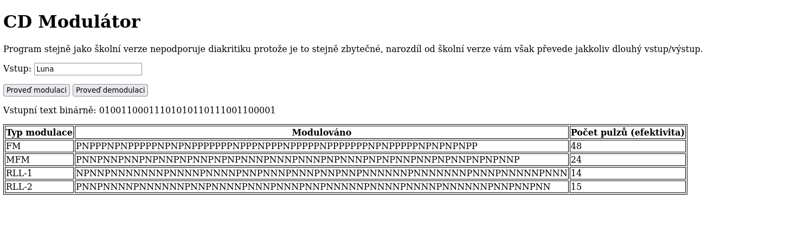
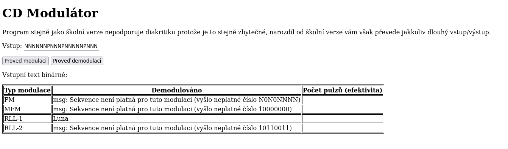

# AE Online Modulator

[Online verze originálu](https://github.com/qespr/ae-utb-modulator). Více než o online verzi jde spíš o verzi u které
nepotřebujete Javu ale stačí vám prohlížeč se zaplým javascriptem.

Podporuje všechny typy modulace a demodulace které byly zadány v AE.

Asi bych si mohl zjistit jak vytvořit GitHub pages a nechat to hostovat "zadara"" ale na druhou stranu, pokud jste moc líní
stáhnout a extrahovat zip, tak si nezasloužíte instatní vypracování úkolu.

## Použití

- Stáhněte si Release Zip a extrahujte kam chcete (já na takové věci preferuju ``/tmp/``)
- Otevřte index.html v prohlížeči se zaplým javascriptem
- Vložte text, dejte modulovat a získáte všechny modulace včetně převodu na binárku a jejich efektivity, viz obrázky
- Pokud zadáte Již modulovaný text tak dejte demodulovat, provedou se opět všechny modulace, pokud nějaká nejde aplikovat dozvíte
  se to.

Program obsahuje jakýsi error helper který se vám pokusí vyznačit kde jste udělaly chybu pokudy by jste to převáděli ručně a
chcete si to jen zkontrolovat. Tento error helper ale funguje mnohem lépe v originální JVM verzi, tady je to spíš z nouze ctnost.

## Sestavení

Je s tím celkem oser, nevím kdo by to chtěl dělat ale pro případ že někdo jo:

- je to ve figwheelu
- Já to spouštím přes ``cider`` v Emacsu (``cider-jack-in-cljs``)
- Z terminálu to lze spustit pomocí ``clojure -A:dev -m figwheel.main -b dev -r`` (asi) Pokud chcete REPL
- Pokud vám jde o Release build tak to je ``clojure -A:dev -m figwheel.main --build-once release``

Kód není plně naportovaný, přepsáno je jen to nejnutnější aby to fungovalo, to jen aby jste se nedivily těm warningům při
kompilaci.

## Obrázky

Když už sem je udělal tak co s něma.

